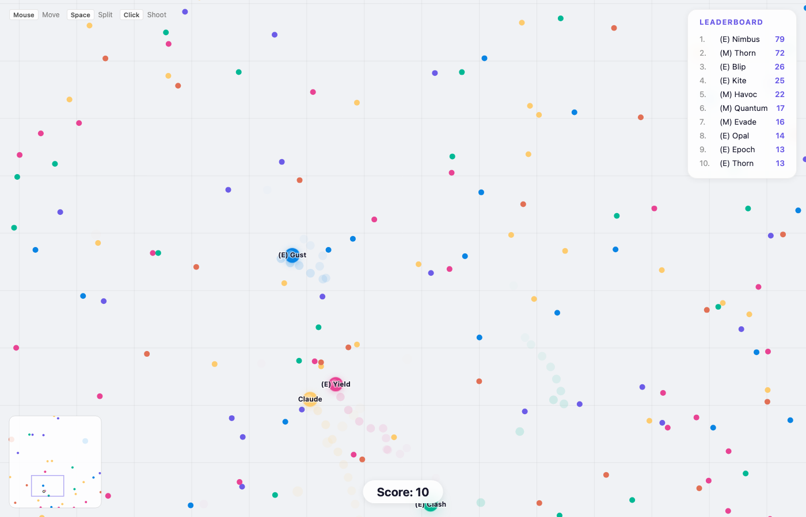
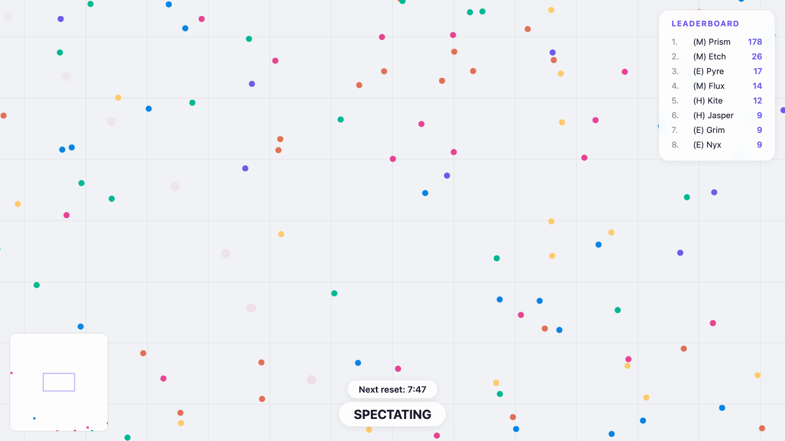
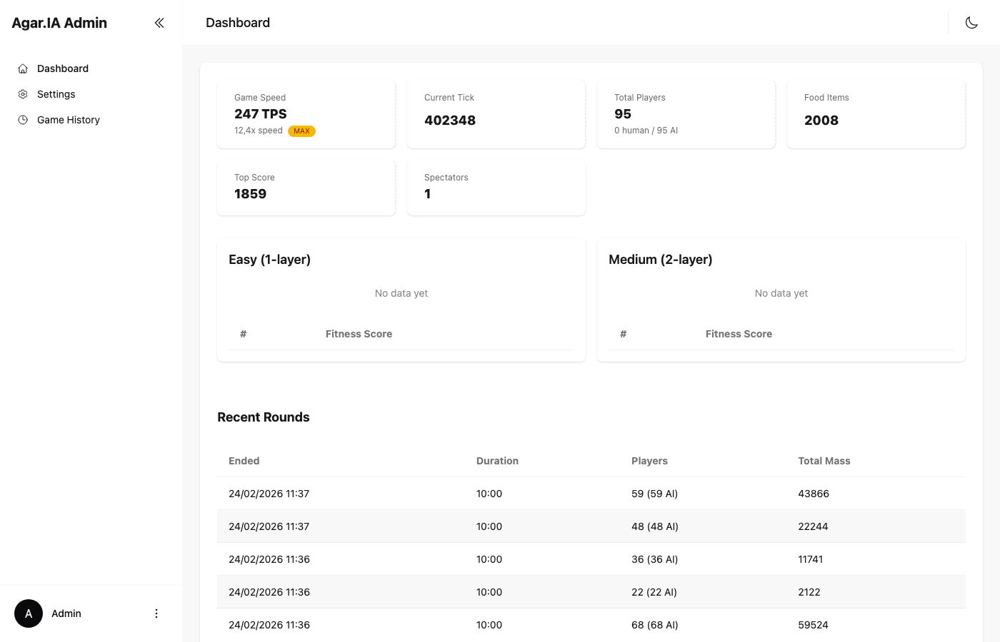

# Agar.IA

An agar.io-style multiplayer cell arena game where AI players evolve using genetic algorithms and neural networks. Built with .NET 10, SignalR, and vanilla JavaScript with HTML5 Canvas.



## Getting Started

### Prerequisites

- [.NET 10 SDK](https://dotnet.microsoft.com/download/dotnet/10.0)
- [Node.js](https://nodejs.org/) (for building frontend assets)

### Install & Run

```bash
# Clone the repository
git clone https://github.com/daniel3303/AgarIA.git
cd AgarIA

# Install frontend dependencies and build assets
cd AgarIA.Web
npm install
npm run build
cd ..

# Build and run
dotnet build AgarIA.slnx
dotnet run --project AgarIA.Web
```

The server starts on a local port (shown in the terminal). Open the URL in your browser to play.

### Docker

Pull the pre-built image from Docker Hub:

```bash
docker run -p 5274:5274 -v agaria-data:/app/data daniel3303/agaria:latest
```

The volume mounts to `/app/data`, persisting the SQLite database (`admin.db`) and evolved genome files (`ai_genomes_*.json`) across container restarts.

Open `http://localhost:5274` in your browser.

## How to Play


Enter a username and click **PLAY** to join, or **SPECTATE** to watch the AI bots evolve.

### Controls

| Control | Action |
|---------|--------|
| **Mouse** | Move toward cursor |
| **Space** | Split your cell |
| **Click** | Shoot a projectile |

### Game Rules

- Every player starts with **10 mass**
- Eat **food pellets** (+1 mass each) scattered across the 4000x4000 map
- Eat **other players** by being at least **15% larger** (1.15x mass ratio) and overlapping them
- **Splitting** divides your cell in two (minimum 24 mass required, max 4 split cells per player). Split cells merge back after a cooldown (200 ticks / 10 seconds)
- **Shooting** fires a projectile that costs 1 mass. Hitting a smaller player rewards mass proportional to the size difference (up to 20)
- **Mass decays** over time (0.02% per tick) — you must keep eating to maintain size
- Eating food or players grants a brief **speed boost**
- Base speed is 4.0 for all cells regardless of mass

## Spectate Mode



In spectate mode you can observe the AI bots competing and evolving in real time.

- **WASD / Arrow keys** — Pan the camera
- **Mouse wheel** — Zoom in/out
- **Countdown timer HUD** — Shows time remaining (MaxTime reset) or score threshold (MaxScore reset)
- **Reset at score** — Automatically reset the game when any player reaches a score threshold (forces new generations)
- **Max Speed** — Run the simulation without tick delay for faster evolution
## Admin Dashboard



The project includes a password-protected admin panel at `/admin/` for monitoring the simulation, adjusting game settings, and viewing round history. Default credentials: **admin** / **admin**.

## AI Architecture

### Neural Network

Each AI bot is controlled by a feedforward neural network with configurable hidden layers. Bots are split evenly across three tiers:

- **Easy** `(E)` — default: 1×64 hidden neurons
- **Medium** `(M)` — default: 1×128 hidden neurons
- **Hard** `(H)` — default: 2×128 hidden neurons

```
Easy:   161 inputs → [64] hidden (tanh) → 6 outputs
Medium: 161 inputs → [128] hidden (tanh) → 6 outputs
Hard:   161 inputs → [128, 128] hidden (tanh) → 6 outputs
```

The hidden layer architecture for each tier is configurable from the admin Settings page (e.g. "128,64" for two hidden layers of 128 and 64 neurons). Changing a tier's architecture deletes its genome file and resets training.

#### Input Features (161)

| Feature Group | Count | Description |
|---------------|-------|-------------|
| Self info | 7 | Mass relative to largest, absolute mass (1/mass), can-split flag, two largest cells' positions |
| Nearest food | 64 | 32 closest food items (dx, dy each) |
| Nearest players | 80 | 16 closest players (dx, dy, relative mass, vx, vy each) |
| Nearest projectiles | 10 | 5 closest projectiles (dx, dy each) |

#### Output Decisions (6)

| Output | Description |
|--------|-------------|
| 0-1 | Movement direction (continuous X, Y via tanh, scaled to ±200px offset) |
| 2 | Split decision (> 0.5 triggers split) |
| 3 | Shoot decision (> 0.5 triggers shoot) |
| 4-5 | Shoot direction (dx, dy) |

### Genetic Algorithm

Each tier has its own independent genetic algorithm with a pool of **64 genomes**:

- **Selection**: Tournament selection (pick 4 random, keep the fittest) — moderate pressure balances exploitation with exploration
- **Elitism**: Top 2 genomes are carried forward unmutated each generation, preserving the best solutions
- **Random immigrants**: 10% of offspring are fresh random genomes, continuously injecting diversity to prevent population collapse
- **Block crossover**: 70% chance — picks 1–3 random crossover points and alternates contiguous segments from each parent, preserving neuron-level weight correlations (unlike uniform per-weight crossover which scrambles co-adapted weights)
- **Adaptive mutation rate**: Scales inversely with genome size using Easy tier (10,374 weights) as reference — Easy ~15%, Medium ~7.5%, Hard ~4.2%, clamped to [1%, 20%]. Larger networks get gentler mutations to avoid destroying learned structure
- **Self-adaptive sigma**: Each genome carries its own mutation strength (sigma). Children inherit the average of their parents' sigmas, then sigma itself mutates: `sigma *= exp(τ × gaussian())` where `τ = 1/√genomeSize`. Clamped to [0.01, 1.0]. This lets the population self-tune mutation intensity over generations
- **Pool management**: When pool exceeds 64, an inverse tournament (pick 4 random, evict the worst) removes a genome — this stochastic eviction preserves more mid-tier diversity than always removing the absolute worst. Fitness is always updated to the latest run, allowing natural turnover when previously dominant genomes underperform
- **Live checkpoints**: Every 30 seconds, all live bots report their current fitness to the pool. This ensures long-surviving dominant bots keep their genomes competitive without waiting until death

#### Fitness Decay

Every 30 seconds, all existing pool entries are multiplied by **0.95**. This prevents old genomes that scored high when competition was weak from permanently dominating the pool. After 5 minutes a genome's stored fitness is at ~60%, after 15 minutes ~21%, forcing gradual turnover while keeping scores meaningful during gameplay. Live bot checkpoints counterbalance this decay — a bot that keeps growing will keep refreshing its genome's fitness in the pool.

### Fitness Function

The fitness function is designed to reward aggressive, efficient play while discouraging same-tier farming:

```
fitness = (score + crossTierMassEaten) × (1 / sqrt(aliveTicks)) × monopolyPenalty
```

| Component | Description |
|-----------|-------------|
| **score** | Final mass at death (already includes mass eaten from players) |
| **crossTierMassEaten** | Mass gained from eating players of a **different tier or humans only** — same-tier kills are excluded to prevent clone farming (see below) |
| **1 / sqrt(aliveTicks)** | Time efficiency factor — rewards bots that gain mass quickly rather than surviving passively |
| **monopolyPenalty** | `1.0 - killerMassShare` — if the killer had most of the total mass, the victim's genome isn't penalized as harshly |

#### Why same-tier kills are ignored

Without this rule, the genetic algorithm converges to a single dominant genome that clones itself across the entire tier. All clones develop identical behavior (e.g., rushing to the same map corner), and the first clone to arrive eats all the others — earning a massive fitness bonus that reinforces the "cluster and cannibalize" strategy. By ignoring same-tier kills in fitness, bots can only improve by eating food, hunting players from other tiers, or eating human players — encouraging diverse spatial strategies instead of clone farming.

### Genome Persistence

Evolved neural network weights auto-save to `ai_genomes_easy.json`, `ai_genomes_medium.json`, and `ai_genomes_hard.json` every 60 seconds. Each tier has its own genome file. These files persist across server restarts, allowing evolution to continue across sessions. Delete them to start fresh.

## Tech Stack

- **Backend**: .NET 10 (ASP.NET Core)
- **Real-time**: SignalR WebSockets
- **Frontend**: Vanilla JavaScript, HTML5 Canvas
- **AI**: Custom neural network + genetic algorithm (no ML frameworks)
- **Admin UI**: Tailwind CSS v4, DaisyUI v5, Vite